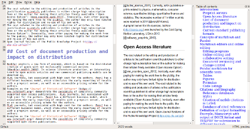

**Correspondence**: Prof. Dr. Robert Winkler, <robert.winkler@cinvestav.mx>, CINVESTAV Unidad Irapuato, Department of Biochemistry and Biotechnology, Laboratory of Biochemical and Instrumental Analysis (labABI, <http://www.ira.cinvestav.mx/lababi.aspx>), Km. 9.6 Libramiento Norte Carr. Irapuato-León 36821 Irapuato, Gto. Mexico, Tel.: +52 (462) 623 96 35, Fax +52 (462) 624 58 46

**Keywords**: markdown, latex, publishing, typesetting

# Introduction
Agile development of science depends on the continuous exchange of information between the researchers [@woelfle_open_2011]. In the past, physical copies of scientific works had to be produced and distributed. Therefore, publishers needed to invest considerable economical resources for typesetting and printing. Since the journals were mainly financed by their subscribers, their editors not only had to decide on the scientific quality of a submitted manuscript, but also on the potential interest for their readers. The availability of globally connected computers enabled the rapid exchange of information at low cost. Yochai Benkler (2006) predicts important changes in the information production economy, which are based on three observations: 

1. A nonmarket motivation in areas such as education, arts, science, politics and theology.
2. The actual rise of nonmarket production, made possible through networked individuals and coordinate effects.
3. The emergence of large-scale peer production, e.g. of software and encyclopaedias.

Immaterial goods such as knowledge and culture are not lost, when consumed or shared - they are 'nonrival' -, which enables a networked information economy, which is not commercially driven [@benkler_wealth_2006].


## Preprints and e-prints
In some areas of science already existed a preprint culture, i.e. a paper-based exchange system of research ideas and results, when Paul Ginsparg in 1991 initiated a server for the distribution of electronic preprints - 'e-prints' - about high-energy particle theory at the  Los Alamos National Laboratory (LANL), USA [@ginsparg_first_1994]. Later, the LANL server moved with Ginsparg to Cornell University, USA, and was renamed to arXiv [@butler_alamos_2001]. 
Currently, arXiv (<https://arxiv.org/>) publishes e-prints related to physics, mathematics, computer science, quantitative biology quantitative finance and statistics. Just a few years after the start of the first preprint servers, their important contribution to scientific communication was evident [@ginsparg_first_1994,youngen_citation_1998,@brown_e-volution_2001]. In 2014, arXiv reached the impressive number of 1 million e-prints [@van_noorden_arxiv_2014].
In more conservative areas, such as chemistry and biology, accepting the publishing prior peer-review took more time [@brown_role_2003]. A preprint server for life sciences (<http://biorxiv.org/>) was launched by the Cold Spring Habor Laboratory, USA, in 2013 [@callaway_preprints_2013]. PeerJ preprints (<https://peerj.com/preprints/>), started in the same year, accepts manuscripts from biological sciences, medical sciences, health sciences and computer sciences. The terms 'preprints' and 'e-prints' are used synonymously, since the physical distribution of preprints has become obsolete.
A major drawback of preprint publishing are the sometimes restrictive policies of scientific publishers. The SHERPA/RoMEO project informs about copyright policies and self-archiving options of individual publishers (<http://www.sherpa.ac.uk/romeo/>).    

## Open Access 
The term *'Open Access'* was introduced 2002 by the Budapest Open Access Initiative and was defined as:
  
*"Barrier-free access to online works and other resources. OA literature is digital, online, free of charge (gratis OA), and free of needless copyright and licensing restrictions (libre OA)."* [@suber_open_2012]   

Frustrated by the difficulty to access even digital scientific literature, three scientists founded the *Public Library of Science (PLoS)*. In 2003, *PLoS Biology* was published as the first fully Open Access (OA) journal for biology [@brown_why_2003, @eisen_publish_2003]. Thanks to the great success of OA publishing, many traditional print publishers now offer a so-called 'Open Access option', to make accepted articles free to read. The copyright in this hybrid models might remain with the publisher, whilst fully OA usually provide a liberal license, such as the Creative Commons Attribution 4.0 International (CC BY 4.0, <https://creativecommons.org/licenses/by/4.0/). 
In a recent study, the article processing charges (APCs) for research intensive universities in the USA and Canada were estimated to be about 1,800 USD for fully OA journals and 3,000 USD for hybrid OA journals [@solomon_article_2016].
PeerJ (<https://peerj.com/>), an OA journal for biological and computer sciences launched 2013, drastically reduced the publishing cost and offers its members a life-time publishing plan for a small registration fee [@van_noorden_journal_2012]. OA literature is only one component of a more general *'open'* philosophy, which also includes the access to scholarships, software, and data [@willinsky_unacknowledged_2005]. Interestingly, there are several different 'schools' of thinking on how to understand and define *'Open Science'*, including the position that any science is open, because of its objective to make generated knowledge public [@fecher_open_2014].


## Cost of document production and impact on distribution


PLoS journals, but associated with high cost for the authors. PeerJ has a different business model, which stimulates the early reporting of results with a preprint server, as well as an accessible pricing scheme for the authors.   
Examples as the *Journal of Statistical Software* (https://www.jstatsoft.org/) demonstrate the possiblity of completely community supported open access publications.  PLoS journals, but associated with high cost for the authors. PeerJ has a different business model, which stimulates the early reporting of results with a preprint server, as well as an accessible pricing scheme for the authors.
PLoS journals, but associated with high cost for the authors. PeerJ has a different business model, which stimulates the early reporting of results with a preprint server, as well as an accessible pricing scheme for the authors.

Examples such as the *Journal of Statistical Software* (JSS, <https://www.jstatsoft.org/>) demonstrate the possibility of completely community supported open access publications. Technically, the editorial system of JSS is based on the Open Journal Systems of the Public Knowledge Project (<https://pkp.sfu.ca/ojs/>). Submissions have to be prepared in the LATEX style of the journal. JSS is peer-reviewed, indexed by Thomson Reuters, and ranks in the Q1 quality quartile in all registered subject categories of the Scimago Journal & Country Rank (<http://www.scimagojr.com/>), which demonstrates that the noncommercial publication of high-quality journals is feasible.


Although a submitted manuscript might be accepted by a journal 'as is', it still needs to be adjusted to the particular publication style in the production stage. Generally speaking, a scientific manuscript is composed from contents and formatting. Whilst the content, i.e. text, figures, tables, citations etc., may remain the same between different publishing forms and journal styles, the formatting can be rather different.<br>
The cost related to the editing and production of articles is the justification scientifc publishers to either charge high subscription fees or the author for making their articles freely available ('Open Access Option'). [@van_noorden_open_2013]. Ironically, even after paying for making the work free to the public, the author may only have limited rights for distribution and re-use of his own work.


## Current standard publishing formats

Ignoring the **Guide for Authors**, e.g. by submitting a manuscript with a different reference style, gives a negative impression with a journal's editorial staff. Too carelessly prepared manuscripts can even provoke a straight 'desk-reject' [@volmer_how_2016].
Scientific journal accept either DOC(X), LATEX and/ or PDF submissions.


a which are presented in a certain format. This format depends on the intended use, e.g. for for submission to a particular journal,  publication as a printed or electronic book, or for a webpage. Incompatible file formats, markdown with different target formats.
Current publishing formats PDF HTML EPUB.<br>
Typesetting software, word processors such as Microsoft Word, LibreOffice, WPS Office, What You See Is What You Get (WYSIWYG), LaTeX What You See Is What You Want (WYSIWYW), hybrids such as LyX What You See Is What You Mean (WYSIWYM). Because of the sometimes complicated syntax specifications, simple conversions between file formats can be difficult or impossible.<br>
In academic publishing, the following types of works require the creation of different output formats from the same source text:

- For the publishing of a book, with a print version in PDF and an electronic version in EPUB.
- For distributing of a seminar script, with an online version in HTML and a print version in PDF.
- For submitting a journal manuscript for peer-review in DOCX, as well as a pre-print version with another journal style in PDF.


**Table xx.** Current standard formats for publishing

Type | Description | Use | Syntax | Reference
:--- | :---------- | :-- | :----- | :--------
DOCX | Office Open XML | WYSWYG editing | XML, ZIP |
ODT |
PDF |
EPUB |
LATEX |
HTML |
MD |

**Table xx.** Examples for formatting elements and their implementations in different markup languages types.

Element              | Markdown     | LATEX                  | HTML
:------------------- | :----------- | ---------------------- | --------------------
**structure**        |              |                        |
section              | `# Intro`    | `\section{Intro}`      | `<h1><Intro></h1>`
subsection           | `## History` | `\subsection{History}` | `<h2><History></h2>`
**text formatting**  |              |                        |
bold                 | `**text**`   | `\textbf{text}`        | `<b>text</b>`
italics              | `*text*`     | `\textit{text}`        | `<i>text</i>`
**cross references** |              |                        |
http link            | `<https://arxiv.org/>` | `\usepackage{url}`                        | ` <a href="https://arxiv.org/"></a> `
                     |              | `\url{https://arxiv.org/}`                       | 

Documents with the commonly used Office Open XML (DOCX Microsoft Word files) and OpenDocument (ODT LibreOffice) file formats can be opened in a standard text editor after unzipping. However, content and formatting information is distributed into various folders and files.
Overall, markdown displays the simplest structure, which facilitates the editing of documents.

Several programs for the conversion between documents formats exist, such as the e-book library program calibre <https://code.google.com/archive/p/faenza-icon-theme/>. But the results of such conversions are often not satisfactory and require substancial manual corrections. Therefore, we were looking for a solution, which enables the creation of scientific manuscripts in a simple format, and the subsequent generation of multiple output formats.

# Concepts of markdown and Pandoc
Markdown was originally developed by John Gruber in collaboration with Aaron Swartz, with the goal of simplifying the writing of HTML documents <http://daringfireball.net/projects/markdown/>.

Despite it's original focus on the web, it is has been proven to be well suited
for academic writing [@ovadia_markdown_2014].

<br>
**Figure xx.** Workfow for the generation of multiple document formats with Pandoc.

# Markdown editors and online editing
**Fig. xx** summarized various options for local or networked editing of MD files.
 
  

**Figure xx.** Markdownfile can be edited on local devices or on cloud drives. For advanced version control in collaborative working, a local or remote git repository may be used. 


## Markdown editors
Because of the simple syntax, basically any text editor is suitable for editing markdown files. For several popular text editors, such as vim (<http://www.vim.org/>), GNU Emacs (<https://www.gnu.org/software/emacs/>), atom (<https://atom.io/>) or geany (<http://www.geany.org/>), plugins provide additional functionality for markdown editing, such as syntax highlighting, live preview or structure browsing.
On the other side, in the last years plenty of special mardown editors have been published. Many of those are cross-platform compatible, e.g. Abricotine (<http://abricotine.brrd.fr/>), Ghostview (<https://github.com/wereturtle/ghostwriter>) and CuteMarkEd (<https://cloose.github.io/CuteMarkEd/>).
xx Writing on the go mobile devices,
Even for tablets, Android and iOS devices, numerous free and low-cost applications exist. Parts of this text were written in xx JotterPad dictation and swipe softwarexx Various of those applications support the cloud storage of documents.

<br>
**Figure xx.** Editing window, HTML preview and table of contents using the CuteMarkEd editor.

## Online editing and collaborative writing

xx Google Docs test editing.

In recent years, several platforms were developed for collaborative writing. Google Docs. OwnCloud with Markdown Editor plugin (see section xx).

<br>
**Figure xx.** Direct online editing of this manuscript with live preview using the ownCloud Markdown Editor plugin by Robin Appelman.

## Document versioning and change control
Integrated in editing software or cloud server, low overhead of the files diff, git.

<br>
**Figure xx.** Version control and collaborative editing using a git repository on bitbucket.

# Pandoc markdown for scientific texts
Following the potential of typesetting scientific manuscripts with Pandoc is demonstrated with examples for typical document elements, such as formulas, figures, tables, code listings and references. The complete Pandoc User's Manual can be found at <http://pandoc.org/MANUAL.html>.

## Tables

Pipe tables are less strict in their syntax

```
| Left | Center | Right | Default |
|:-----|:------:|------:|---------|
| LLL  | CCC    | RRR   | DDD     |
```

gives

Left | Center | Right | Default
:--- | :----: | ----: | -------
LLL  |  CCC   |   RRR | DDD

## Figures

## Formulas

Formula can be inserted in LaTeX mode using delimiters (`$` for Pandoc, `$$` adds compatibility for online preview rendering with CuteMarkEd/MathJax). E.g. the formula for calculating the standard deviation $s$ of a random sampling would be written as:

~~~
$s=\sqrt{\frac{1}{N-1}\sum_{i=1}^N(x_i-\overline{x})^{2}}$
~~~

and gives:

$s=\sqrt{\frac{1}{N-1}\sum_{i=1}^N(x_i-\overline{x})^{2}}$

with $x_i$ the individual observations, $\overline{x}$ the sample mean and $N$ the total number of samples.

## Code listings
Verbatim code blocks are indicated by three tilde symbols:
    ~~~
    verbatim code
    ~~~
Typeseting `inline code` is possible by enclosing text between back ticks ``.

# Citations and biography

## Reference databases
bibtex databases, which are supported by almost any reference management program.

## Styles
Whereas natbib bibtex is supported by Pandoc, it is incompatible with DOCX xx.
The  Citation Style Language (CSL) <http://citationstyles.org/> is used for the citations and bibliographies. This file format is supported e.g. by the reference management programs Mendeley <https://www.mendeley.com/>, Papers <http://papersapp.com/> and Zotero <https://www.zotero.org/>.
CSL styles for particular journals can be found from the Zotero style repository <https://www.zotero.org/styles>.
The bibliography style, which Pandoc should use for the target document can be chosen or in the YAML block of the markdown document or can be passed as an command line option. The later is more recommendable, because different bibliography style may be used for different documents.

## Creation of natbib citations in LaTeX
For citations in scientific manuscripts written in LaTeX, the natbib package is widely used. To create TEX output file with natbib citations, Pandoc simply has to be run with the `--natbib` option.

## Database of cited references
To share the bibliography for a certain manuscript with co-authors or the publisher's production team, it is often desirable to generate a subset of a larger database, which only contains cited references.
If the `--natbib` option was used for creating a PDF file (xx LATEX-PDF?), LATEX creates an AUX file, which can be extracted using BibTool:
    ~~~
    bibtool -x md-article.aux -o bibshort.bib
    ~~~
In this case the new database would be called `bibshort.bib`.
If no AUX file is present, it has to be created manually:
1. The reference keys have to be extracted from the manuscript. This can be done by a simple Perl (<https://www.perl.org/>) command:
    ~~~
    perl -ne 'print "$1," if /(?<=@)(.+?)(?=[\],])/' article.md
    ~~~
    The command prints out the keys of the file `article.md`, separated by comas. Domains of email adresses also will be returned, but this does not affect the creation of the final database.
2. A bibtex `.aux` file (e.g. `bibextract.aux`) has to be created, containing the name of the database (here: `zotero.bib`) and the extracted keys, separated by comas (from the previous step):
    ~~~
    \bibstyle{alpha}
    \bibdata{zotero.bib}
    \citation{smith_software_2016,key2,key3}
    ~~~
3. Now the new database can be generated with BibTool as mentioned above.

We wrote the Perl script `mdbibexport` with a simple user dialog, which asks asking for the relevant files and performs the generation of an article specific BIB database.

# Definition of output formatting
command line parameters and templates xx

# Example: Manuscript with output of DOCX format and TEX/PDF for submission to different journals.
DOCX the most common, but also LATEX only journals, PeerJ pre-print server

## Development of DOCX template

A first DOCX document with bibliography in APA format is created with Pandoc DOCX output:

~~~
pandoc -S -s --csl=apa.csl --filter pandoc-citeproc
-o pandoc-manuscript.docx agile-editing-pandoc.md
~~~

The document settings and styles of the resulting file `pandoc-manuscript.docx` can be modified, and following it can be used as document template (`--reference-docx=pandoc-manuscript.docx`).

~~~
pandoc -S -s --reference-docx=pandoc-manuscript.docx
--csl=apa.csl --filter pandoc-citeproc -o outfile.docx agile-editing-pandoc.md
~~~

It is also possible to directly re-use a previous output file as template (i.e. template and output file have the same file name):

~~~
pandoc -S -s --columns=10 --reference-docx=outfile.docx --csl=apa.csl --filter pandoc-citeproc -o outfile.docx agile-editing-pandoc.md
~~~

In this way, the template can be incrementally adjusted to the desired document formatting. The final document may be employed later as Pandoc template for other manuscripts with the same specifications. In this case, running Pandoc the first time with the template, the contents of the new manuscript would be filled into the provided DOCX template.
A page with DOCX manuscript formatting of this article is shown in figure xx.


**Figure xx.** DOCX output with a modified document template.

## Development of a TEX/PDF template
~~~
pandoc -D latex > template-peerj.latex
~~~

# Automating document production
The commands necessary to produce the document in a specific formats or styles can be defined in a simple `Makefile`. An example `Makefile` is included in the source code of this preprint.  The desired output file format can be chosen when calling `make`. E.g. `make outfile.pdf` produces this preprint in PDF format.Calling `make` without any option creates all listed document types.

## Cross-platform compatibility
The `make` process was tested on xx Windows 10, Linux 64 bit and iOS X. All documents - DOCX, LATEX, PDF, EPUB and HTML - were generated successfully, which demonstrates the cross-platform compatibility of the workflow.

# Conclusions
Authoring scientific manuscripts in markdown (MD) format is straight-forward, and manual formatting  is reduced to a minimum. The simple syntax of MD facilitates the document editing and collaborative writing.  The rapid conversion of MD to multiple formats such as DOCX, LATEX, PDF, EPUB and HTML can be done easily using Pandoc, and templates enable the automated generation of documents according to specific journal styles. Altogether, the MD format supports the agile writing and fast production of scientific literature. The associated time and cost reduction especially favours community-driven publication strategies.

# Acknowledgments
We cordially thank Dr. Gerd Neugebauer for his help in creating a subset of a bibtex data base using BibTool. The work was funded by the Consejo Nacional de Ciencia y Tecnología (CONACyT) Mexico, with the grant FRONTERAS 2015-2/814 and by institutional funding of the Centro de Investigación y de Estudios Avanzados del Instituto Politécnico Nacional (CINVESTAV).

# Software and code availability
The relevant software for creating this manuscript used is cited according to [@smith_software_2016]. Since unique identifiers are missing for most software projects, we only refer to the project homepages or software repositories:

Software        | Use                                   | Authors                         | Version  | Release date | Homepage/ repository
:-------------- | :------------------------------------ | :------------------------------ | :------- | :----------- | :----------------------------------------------
Pandoc          | universal markup converter            | John MacFarlane                 | 1.16.0.2 | 2016/01/13   | <http://www.pandoc.org>
pandoc-citeproc | library for CSL citations with Pandoc | John MacFarlane, Andrea Rossato | 0.9.1    | 2016/03/19   | <https://github.com/jgm/pandoc-citeproc>
ownCloud        | personal cloud software               | ownCloud GmbH, Community        | 9.1.1    | 2016/09/20   | <https://owncloud.org/>
Markdown Editor | plugin for ownCloud                   | Robin Appelman                  | 0.1      | 2016/03/08   | <https://github.com/icewind1991/files_markdown>
BibTool | Bibtex database tool | Gerd Neugebauer | 2.63 | 2016/01/16 |  <https://github.com/ge-ne/bibtool>
mdbibexport   | bibliography of cited references | Robert Winkler | 0.10 | 2016/10/31 | https://github.com/robert-winkler/mdbibexport

xx CuteMarkEd xx
xx JotterPad Prof xx
Pandoc is available for Windows, Mac OS X, Linux, BSD and as source code.

The source code of this manuscript, as well as templates and the Pandoc script have been deposited to xx.

Drawings for document types, devices and applications have been adopted from Calibre <http://calibre-ebook.com/>, openclipart <https://openclipart.org/> and the GNOME Theme Faenza <https://code.google.com/archive/p/faenza-icon-theme/>.


# Bibliography
