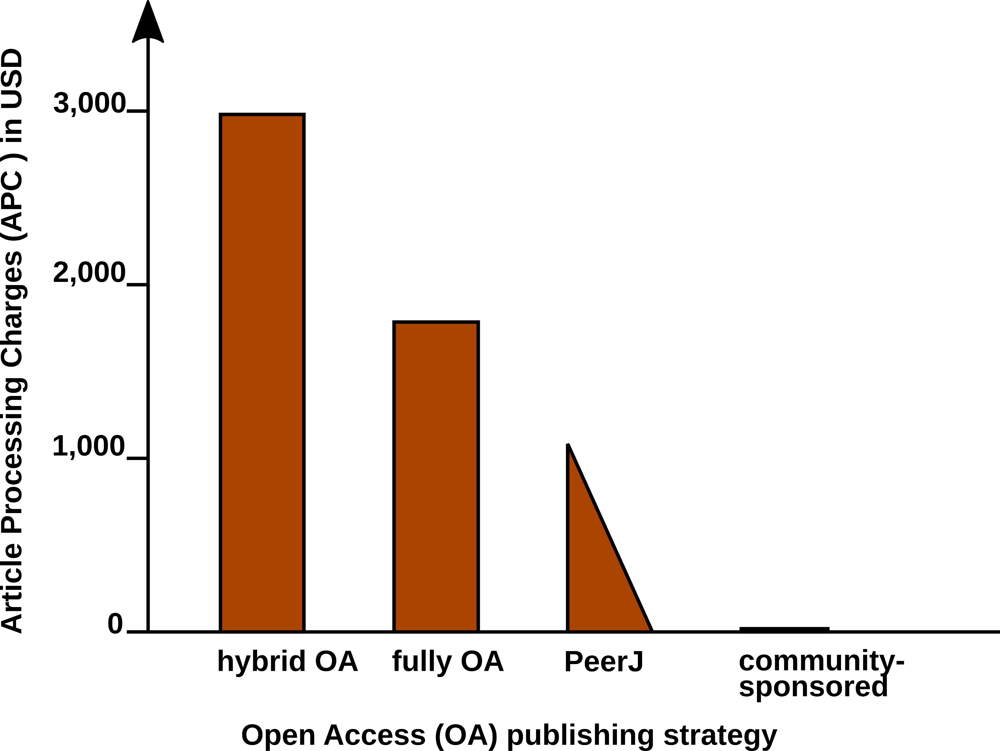
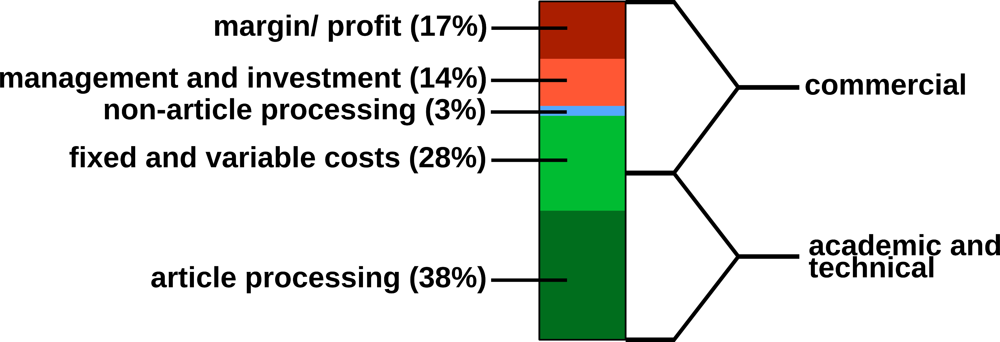
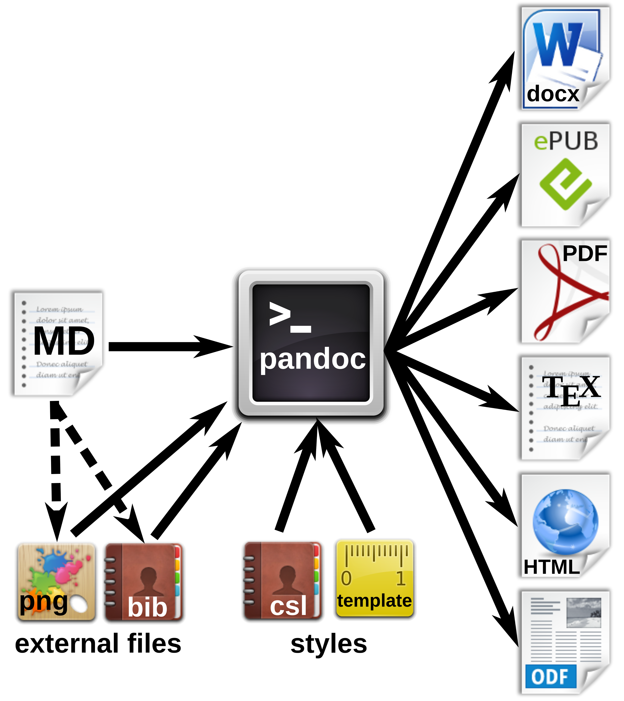
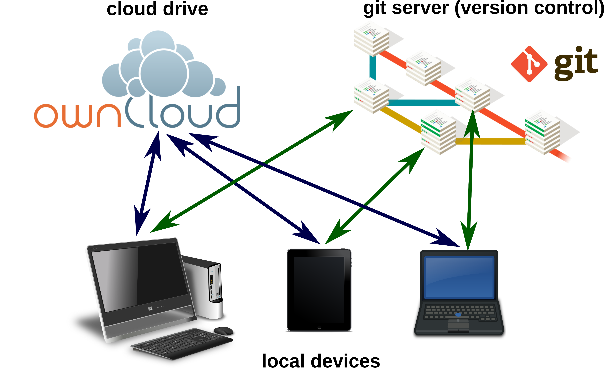
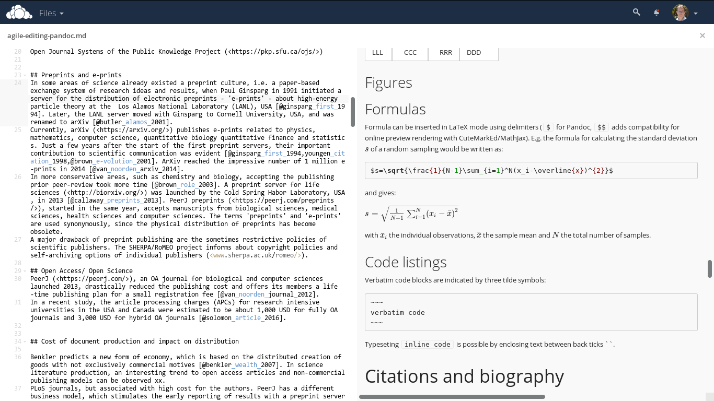
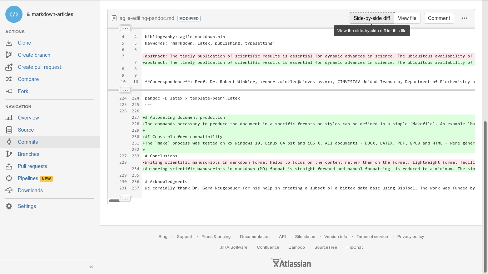
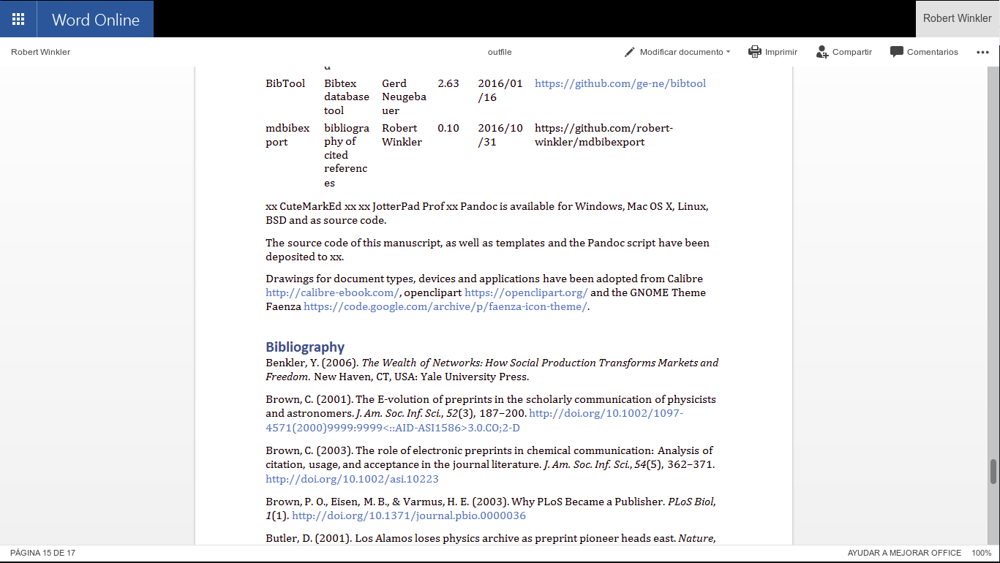

**Affiliations:** ¹ Pandoc Development Team, ² CINVESTAV Unidad Irapuato, Department of Biochemistry and Biotechnology, Laboratory of Biochemical and Instrumental Analysis, Km. 9.6 Libramiento Norte Carr. Irapuato-León, 36821 Irapuato, Gto. Mexico

**Correspondence:** Prof. Dr. Robert Winkler, <robert.winkler@cinvestav.mx>

**Keywords:** open science, document formats, markdown, latex, publishing, typesetting

# Abstract

The timely publication of scientific results is essential for dynamic advances in science. The ubiquitous availability of computers which are connected to a global network made the rapid and low-cost distribution of information through electronic channels possible. New concepts, such as Open Access publishing and preprint servers are currently changing the traditional print media business towards a community-driven peer production. However, the cost of scientific literature generation, which is either charged to readers, authors or sponsors, is still high. The main active participants in the authoring and evaluation of scientific manuscripts are volunteers, and the cost for online publishing infrastructure is close to negligible. A major time and cost factor though is the formatting of manuscripts in the production stage. In this article we demonstrate the feasibility to write scientific manuscripts in plain markdown (MD) text files, which can be easily converted into common publication formats, such as PDF, HTML or EPUB, using pandoc. The simple syntax of markdown assures the long-term readability of raw files and the development of software and workflows. We show the implementation of typical elements of scientific manuscripts -- formulas, tables, code blocks and citations -- and present tools for editing, collaborative writing and version control. We give an example on how to prepare a manuscript with distinct output formats, a DOCX file for submission to a journal and a LATEX/PDF version for deposition as a PeerJ preprint. Reducing the work spent on manuscript formatting translates directly to time and cost savings for writers, publishers, readers and sponsors. Therefore, the adoption of the MD format contributes to the agile production of open science literature.

# Introduction

Agile development of science depends on the continuous exchange of information between the researchers [@woelfle_open_2011]. In the past, physical copies of scientific works had to be produced and distributed. Therefore, publishers needed to invest considerable economical resources for typesetting and printing. Since the journals were mainly financed by their subscribers, their editors not only had to decide on the scientific quality of a submitted manuscript, but also on the potential interest to their readers. The availability of globally connected computers enabled the rapid exchange of information at low cost. Yochai Benkler (2006) predicts important changes in the information production economy, which are based on three observations:

1. A nonmarket motivation in areas such as education, arts, science, politics and theology.
2. The actual rise of nonmarket production, made possible through networked individuals and coordinate effects.
3. The emergence of large-scale peer production, e.g. of software and encyclopedias.

Immaterial goods such as knowledge and culture are not lost, when consumed or shared -- they are 'nonrival' --, and they enable a networked information economy, which is not commercially driven [@benkler_wealth_2006].

## Preprints and e-prints

In some areas of science already existed a preprint culture, i.e. a paper-based exchange system of research ideas and results, when Paul Ginsparg in 1991 initiated a server for the distribution of electronic preprints - 'e-prints' - about high-energy particle theory at the Los Alamos National Laboratory (LANL), USA [@ginsparg_first_1994]. Later, the LANL server moved with Ginsparg to Cornell University, USA, and was renamed to arXiv [@butler_alamos_2001]. Currently, arXiv (<https://arxiv.org/>) publishes e-prints related to physics, mathematics, computer science, quantitative biology quantitative finance and statistics. Just a few years after the start of the first preprint servers, their important contribution to scientific communication was evident [@ginsparg_first_1994;@youngen_citation_1998;@brown_e-volution_2001]. In 2014, arXiv reached the impressive number of 1 million e-prints [@van_noorden_arxiv_2014].<br>
In more conservative areas, such as chemistry and biology, accepting the publishing prior peer-review took more time [@brown_role_2003]. A preprint server for life sciences (<http://biorxiv.org/>) was launched by the Cold Spring Habor Laboratory, USA, in 2013 [@callaway_preprints_2013]. _PeerJ preprints_ (<https://peerj.com/preprints/>), started in the same year, accepts manuscripts from biological sciences, medical sciences, health sciences and computer sciences.<br>
The terms 'preprints' and 'e-prints' are used synonymously, since the physical distribution of preprints has become obsolete. A major drawback of preprint publishing are the sometimes restrictive policies of scientific publishers. The SHERPA/RoMEO project informs about copyright policies and self-archiving options of individual publishers (<http://www.sherpa.ac.uk/romeo/>).

## Open Access

The term _'Open Access'_ was introduced 2002 by the Budapest Open Access Initiative and was defined as:

_"Barrier-free access to online works and other resources. OA literature is digital, online, free of charge (gratis OA), and free of needless copyright and licensing restrictions (libre OA)."_ [@suber_open_2012]

Frustrated by the difficulty to access even digitized scientific literature, three scientists founded the _Public Library of Science (PLoS)_. In 2003, _PLoS Biology_ was published as the first fully Open Access (OA) journal for biology [@brown_why_2003;@eisen_publish_2003].<br>
Thanks to the great success of OA publishing, many conventional print publishers now offer a so-called 'Open Access option', i.e. to make accepted articles free to read for an additional payment. The copyright in this hybrid models might remain with the publisher, whilst fully OA usually provide a liberal license, such as the Creative Commons Attribution 4.0 International (CC BY 4.0, <https://creativecommons.org/licenses/by/4.0/>).<br>
OA literature is only one component of a more general _open_ philosophy, which also includes the access to scholarships, software, and data [@willinsky_unacknowledged_2005]. Interestingly, there are several different 'schools' of thinking on how to understand and define _Open Science_, as well the position that any science is open by definition, because of its objective to make generated knowledge public [@fecher_open_2014].

## Cost of journal article production

In a recent study, the article processing charges (APCs) for research intensive universities in the USA and Canada were estimated to be about 1,800 USD for fully OA journals and 3,000 USD for hybrid OA journals [@solomon_article_2016]. PeerJ (<https://peerj.com/>), an OA journal for biological and computer sciences launched 2013, drastically reduced the publishing cost and offers its members a life-time publishing plan for a small registration fee [@van_noorden_journal_2012]; alternatively the authors can choose to pay an APC of 1,095 USD, which may be cheaper, if multiple co-authors participate.<br>
Examples such as the _Journal of Statistical Software_ (_JSS_, <https://www.jstatsoft.org/>) and _eLife_ (<https://elifesciences.org/>) demonstrate the possibility of completely community-supported OA publications. **Fig. 1** compares the APCs of different OA publishing business models.<br>
_JSS_ and _eLife_ are peer-reviewed and indexed by Thomson Reuters. Both journals are located in the Q1 quality quartile in all their registered subject categories of the Scimago Journal & Country Rank (<http://www.scimagojr.com/>), demonstrating that high-quality publications can be produced without charging the scientific authors or readers.

{#pub-costs}<br>
**Figure 1.** Article Processing Charge (APCs) that authors have to pay for with different Open Access (OA) publishing models. Data from [@solomon_article_2016] and journal web-pages.

In 2009, a study was carried concerning the _"Economic Implications of Alternative Scholarly Publishing Models"_, which demonstrates an overall societal benefit by using OA publishing model [@houghton_economic_2009]. In the same report, the real publication costs are evaluated. The relative costs of an article for the publisher are represented in **Fig. 2**.

<br>
**Figure 2.** Estimated publishing cost for a 'hybrid' journal (conventional with Open Access option). Data from [@houghton_economic_2009].

Conventional publishers justify their high subscription or APC prices with the added value, e.g. journalism (stated in the graphics as 'non-article processing'). But also stakeholder profits, which could be as high as 50%, must be considered, and are withdraw from the science budget [@van_noorden_open_2013].<br>
Generally, the production costs of an article could be roughly divided into commercial and academic/ technical costs (**Fig. 2**). For nonmarket production, the commercial costs such as margins/ profits, management etc. can be drastically reduced. Hardware and services for hosting an editorial system, such as Open Journal Systems of the Public Knowledge Project (<https://pkp.sfu.ca/ojs/>) can be provided by public institutions. Employed scholars can perform editor and reviewer activities without additional cost for the journals. Nevertheless, 'article processing', which includes the manuscript handling during peer review and production represents the most expensive part.<br>
Therefore, we investigated a strategy for the efficient formatting of scientific manuscripts.

## Current standard publishing formats

Generally speaking, a scientific manuscript is composed from contents and formatting. Whilst the content, i.e. text, figures, tables, citations etc., may remain the same between different publishing forms and journal styles, the formatting can be very different. Most publishers require the formatting of submitted manuscripts in a certain format. Ignoring this **Guide for Authors**, e.g. by submitting a manuscript with a different reference style, gives a negative impression with a journal's editorial staff. Too carelessly prepared manuscripts can even provoke a straight 'desk-reject' [@volmer_how_2016].<br>
Currently DOC(X), LATEX and/ or PDF file formats are the most frequently used formats for journal submission platforms. But even if the content of a submitted manuscript might be accepted during the peer review 'as is', the format still needs to be adjusted to the particular publication style in the production stage. For the electronic distribution of scientific works, which is gaining more and more importance, additional formats (EPUB, (X)HTML) need to be generated. **Tab. 1** lists the file formats which are currently the most relevant ones for scientific publishing.

**Table 1.** Current standard formats for scientific publishing.

**Type** | **Description**       | **Use**            | **Syntax**    | **Reference**
:------- | :-------------------- | :----------------- | :------------ | :---------------------------------------------------------
DOCX     | Office Open XML       | WYSIWYG editing    | XML, ZIP      | [@OOXML]
ODT      | OpenDocument          | WYSIWYG editing    | XML, ZIP      | [@ODF]
PDF      | portable document     | print replacement  | PDF           | [@international_organization_for_standardization_iso_2013]
EPUB     | electronic publishing | ebooks             | HTML5, ZIP    | [@eikebrokk_epub_2014]
LATEX    | typesetting system    | high-quality print | TEX           | [@lamport_latex:_1994]
HTML     | hypertext markup      | websites           | (X)HTML       | [@HTML4;@HTML5]
MD       | Markdown              | lightweight markup | plain text MD | [@ovadia_markdown_2014;@rfc7764]

Although be content elements of the documents such as title, author, abstract, text, figures, tables, etc. remain the same, the syntax of the file formats is rather different. **Tab. 2** demonstrates some simple examples of differences in different markup languages.

**Table 2.** Examples for formatting elements and their implementations in different markup languages.

**Element**    | **Markdown** | **LATEX**          | **HTML**
:------------- | :----------- | :----------------- | :-------------------
**structure**  |              |                    |                      |
section        | `# Intro`    | `\section{Intro}`  | `<h1><Intro></h1>`
subsection     | `## History` | `\subsection`      | `<h2><History></h2>`
               |              |                    | `{History}`          |  |
**text style** |              |                    |                      |
bold           | `**text**`   | `\textbf{text}`    | `<b>text</b>**`
italics        | `*text*`     | `\textit{text}`    | `<i>text</i>`
**links**      |              |                    |                      |
http link      | `<https://`  | `\usepackage{url}` | `<a href="https://`
               |              | `arxiv.org/>`      | `\url{https://`      | `arxiv.org/"></a>`
               |              |                    | `arxiv.org/}`        |  |

Documents with the commonly used Office Open XML (DOCX Microsoft Word files) and OpenDocument (ODT LibreOffice) file formats can be opened in a standard text editor after unzipping. However, content and formatting information is distributed into various folders and files. Practically speaking, those file formats require the use of special word processing software.<br>
From a writer's perspective, the use of _What You See Is What You Get (WYSIWYG)_ programs such as Microsoft Word, WPS Office or LibreOffice might be convinient, because the formatting of the document is directly visible. But the complicated syntax specifications often result in problems when using different versions and for collaborative writing. Simple conversions between file formats can be difficult or impossible. In worst case, 'old' files cannot be opened any more.<br>
In some parts of the scientific community therefore LATEX, a typesetting program in plain text format, is very popular. With LATEX, documents with highest typographic quality can be produced. However, the source files are cluttered with LATEX commands and the source text can be complicated to read. Compilation errors in LATEX are sometimes difficult to find. Therefore, LATEX is not very user friendly, especially for casual writers or beginners.<br>
In academic publishing, additionally the creation of different output formats from the same source text is desirable:

- For the publishing of a book, with a print version in PDF and an electronic version in EPUB.
- For the distribution of a seminar script, with an online version in HTML and a print version in PDF.
- For submitting a journal manuscript for peer-review in DOCX, as well as a preprint version with another journal style in PDF.

Some of the tasks can be performed e.g. with LATEX, but an integrated solution remains a challenge. Several programs for the conversion between documents formats exist, such as the e-book library program calibre <https://code.google.com/archive/p/faenza-icon-theme/>. But the results of such conversions are often not satisfactory and require substantial manual corrections.<br>
Therefore, we were looking for a solution, which enables the creation of scientific manuscripts in a simple format, and the subsequent generation of multiple output formats. The need for hybrid publishing has been recognized outside of science [@dptcollective_toolkit_2015; @kielhorn_multi_2011], but the requirements specific to scientific publishing have not been addressed so far. Therefore, we investigated the possibility to generate multiple publication formats from a simple manuscript source file.

# Concepts of markdown and pandoc

Markdown was originally developed by John Gruber in collaboration with Aaron Swartz, with the goal to simplify the writing of HTML documents <http://daringfireball.net/projects/markdown/>. Instead of coding a file in HTML syntax, the content of a document is written in plain text and annotated with simple tags which define the formatting. Subsequently, this markdown (MD) file are parsed to generate the final HTML document. With this concept, the source file remains easily readable and the author can focus on the contents rather than formatting. Despite its original focus on the web, the MD format has been proven to be well suited for academic writing [@ovadia_markdown_2014]. In particular, pandoc MD (<http://pandoc.org/>) adds several extensions which facilitate the authoring of academic documents and their conversion into multiple output formats. **Tab. 2** demonstrates the simplicity of MD compared to other markup languages. **Fig. 3** illustrates the generation of various formatted documents from a manuscript in pandoc MD. Some relevant functions for scientific texts are explained below in more detail.

<br>
**Figure 3.** Workfow for the generation of multiple document formats with pandoc.

# Markdown editors and online editing

The usability of a text editor is important for the author, either writing alone or with several co-authors. In this section we present software and strategies for different scenarios. **Fig. 4** summarizes various options for local or networked editing of MD files.

<br>

**Figure 4.** Markdown files can be edited on local devices or on cloud drives. A local or remote git repository enables advanced advanced version control.

## Markdown editors

Because of the simple MD syntax, basically any text editor is suitable for editing markdown files. The formatting tags are written in plain text and easy to remember. Therefore, the author is not distracted by looking around for layout options with the mouse. For several popular text editors, such as vim (<http://www.vim.org/>), GNU Emacs (<https://www.gnu.org/software/emacs/>), atom (<https://atom.io/>) or geany (<http://www.geany.org/>), plugins additional functionality for markdown editing, e.g. syntax highlighting, command helpers, live preview or structure browsing.<br>
Various dedicated markdown editors have been published as well. Many of those are cross-platform compatible, such as Abricotine (<http://abricotine.brrd.fr/>), ghostwriter (<https://github.com/wereturtle/ghostwriter>) and CuteMarkEd (<https://cloose.github.io/CuteMarkEd/>).<br>
The lightweight format is also ideal for writing on mobile devices. Numerous applications are available on the App stores for Android and iOS systems. The programs Swype and Dragon (<http://www.nuance.com/>) facilitate the input of text on such devices by guessing words from gestures and speech recognition (dictation).<br>
**Fig. 5.** shows the editing of a markdown file, using the cross-platform editor Atom with several markdown plugins.

<br>
**Figure 5.** Document directory tree, editing window and HTML preview using the Atom editor.

## Online editing and collaborative writing

Storing manuscripts on network drives (_The Cloud_) has become popular because of several reasons:

- Protection against data loss.
- Synchronization of documents between several devices.
- Collaborative editing options.

Markdown files on a Google Drive (<https://drive.google.com>) for instance can be edited online with StackEdit (<https://stackedit.io>). **Fig. 6** demonstrates the online editing of a markdown file on an ownCloud (<https://owncloud.com/>) installation.

<br>
**Figure 6.** Direct online editing of this manuscript with live preview using the ownCloud Markdown Editor plugin by Robin Appelman.

Even mathematical formulas are rendered correctly in the HTML live preview window of the ownCloud markdown plugin (**Fig. 6** ).

## Document versioning and change control

Programmers, especially when working in distributed teams, rely on version control systems to manage changes of code. Currently, Git (<https://git-scm.com/>), which is also used e.g. for the development of the Linux kernel, is one of the most employed software solutions for versioning. Git allows the parallel work of collaborators and has an efficient merging and conflict resolution system. A Git respository may be used from a single local author to keep track of changes, or by a team with a remote repository, e.g. on github (<https://github.com/>) or bitbucket (<https://bitbucket.org/>). Because of the plain text format of markdown, Git can be used for version control and distributed writing. For the writing of the present article, the co-authors (Germany and Mexico) used a remote Git repository on bitbucket. The plain text syntax of markdown facilitates the visualization of differences of document versions, as shown in **Fig. 7**.

<br>
**Figure 7.** Version control and collaborative editing using a git repository on bitbucket.

# Pandoc markdown for scientific texts

Following, the potential of typesetting scientific manuscripts with pandoc is demonstrated with examples for typical document elements, such as tables, figures, formulas, code listings and references. A brief introduction is given by [@dominici_pandoc_2014]. The complete Pandoc User's Manual is available at <http://pandoc.org/MANUAL.html>.

## Tables

There are several options to write tables in markdown. The most flexible alternative - which was also used for this article - are pipe tables. The contents of different cells are separated by pipe symbols (`|`):

```
Left | Center | Right | Default
:-----|:------:|------:|---------
 LLL  | CCC    | RRR   | DDD
```

gives

Left | Center | Right | Default
:--- | :----: | ----: | -------
LLL  |  CCC   |   RRR | DDD

The headings and the alignment of the cells is given in the first two lines. The cell width is variable. The pandoc parameter `--columns=NUM` can be used to define the length of lines in characters. If contents do not fit, they will be wrapped.

## Figures

Figures are inserted as follows:

```

```

e.g.

```

```

The `alt text` is used e.g. in HTML output. Additional parameters such as image width are possible.

## Symbols

Scientific texts often require special characters, e.g. Greek letters, mathematical and physical symbols etc.<br>

The UTF-8 standard, developed and maintained by _Unicode Consortium_, enables the use of characters across languages and computer platforms. The encoding is defined as RFC document 3629 of the Network Working group [@rfc3629] and as ISO standard ISO/IEC 10646:2014 [@international_organization_for_standardization_iso/iec_2014]. Specifications of Unicode and code charts are provided on the Unicode homepage (<http://www.unicode.org/>).<br>

In pandoc mardown documents, Unicode characters such as °, α , ä , Å can be inserted directly and passed to the different output documents. For the correct processing of UTF-8 encoding in LATEX, the use of the `--latex-engine=xelatex` option is necessary, further the use of an appropiate font. The Times-like XITS font (<https://github.com/khaledhosny/xits-math>) for high quality typesetting of scientific texts can be set in the LATEX template:

```
\usepackage{unicode-math}
\setmainfont
[    Extension = .otf,
   UprightFont = *-regular,
      BoldFont = *-bold,
    ItalicFont = *-italic,
BoldItalicFont = *-bolditalic,
]{xits}
\setmathfont
[    Extension = .otf,
      BoldFont = *bold,
]{xits-math}
```

To facilitate the input of specific characters, so-called mnemonics can be enabled in some editors (e.g. in atom by the `character-table` package). For example, the 2-character Mnemonics ':u' gives 'ü' (diaeresis), or 'D*' the greek Δ. The possible character mnemonics and character sets are listed in RFC 1345 [@rfc1345].

## Formulas

Formulas are written in LATEX mode using the delimiters `$`. E.g. the formula for calculating the standard deviation $s$ of a random sampling would be written as:

```
$s=\sqrt{\frac{1}{N-1}\sum_{i=1}^N(x_i-\overline{x})^{2}}$
```

and gives:

$s=\sqrt{\frac{1}{N-1}\sum_{i=1}^N(x_i-\overline{x})^{2}}$

with $x_i$ the individual observations, $\overline{x}$ the sample mean and $N$ the total number of samples.

Pandoc parses formulas into internal structures and allows conversion into formats other than LATEX. This allows for format-specific formula representation and enables computational analysis of the formulas [@garnet_semiautomatic_2015].

## Code listings

Verbatim code blocks are indicated by three tilde symbols:

```
~~~
verbatim code
~~~
```

Typeseting `inline code` is possible by enclosing text between back ticks.

```
`inline code`
```

## Other document elements

Those examples are only a short demonstration of the capacities of pandoc concerning scientific documents. For more detailed information, we refer to the official manual ( <http://pandoc.org/MANUAL.html>).

# Citations and biography

The efficient organization and typesetting of citations and bibliographies is crucial for academic writing. Pandoc supports various strategies for managing references. For processing the citations and the creation of the bibliography, the command line parameter `--filter pandoc-citeproc` is used, with variables for the reference database and the bibliography style. The bibliography will be located automatically at the header `# References` or `# Bibliography`.

## Reference databases

Pandoc is able to process all mainstream literature database formats, such as RIS, BIB, etc. However, for maintaining compatibility with LATEX/ BIBTEX, the use of BIB databases is recommended. The used database either can be defined in the YAML metablock of the MD file (see below) or it can be passed as parameter when calling pandoc.

## Inserting citations

For inserting a reference, the database key is given within square brackets, and indicated by an '@'. It is also possible to add information, such as page:

```
[@suber_open_2012; @benkler_wealth_2006, 57 ff.]
```

gives [@suber_open_2012; @benkler_wealth_2006, 57 ff.].

## Styles

The Citation Style Language (CSL) <http://citationstyles.org/> is used for the citations and bibliographies. This file format is supported e.g. by the reference management programs Mendeley <https://www.mendeley.com/>, Papers <http://papersapp.com/> and Zotero <https://www.zotero.org/>. CSL styles for particular journals can be found from the Zotero style repository <https://www.zotero.org/styles>. The bibliography style, which pandoc should use for the target document can be chosen or in the YAML block of the markdown document or can be passed as an command line option. The later is more recommendable, because distinct bibliography style may be used for different documents.

## Creation of LATEX `natbib` citations

For citations in scientific manuscripts written in LATEX, the natbib package is widely used. To create a LATEX output file with natbib citations, pandoc simply has to be run with the `--natbib` option, but without the `--filter pandoc-citeproc` parameter.

## Database of cited references

To share the bibliography for a certain manuscript with co-authors or the publisher's production team, it is often desirable to generate a subset of a larger database, which only contains the cited references. If LATEX output was generated with the `--natbib` option, the compilation of the file with LATEX gives an AUX file (in the example named `md-article.aux`), which subsequently can be extracted using BibTool <https://github.com/ge-ne/bibtool>:

```
~~~
bibtool -x md-article.aux -o bibshort.bib
~~~
```

In this example, the article database will be called `bibshort.bib`.

For the direct creation of an article specific BIB database without using LATEX, we wrote a simple Perl script called `mdbibexport` (<https://github.com/robert-winkler/mdbibexport>).

# Meta information of the document

Document information such as title, authors, abstract etc. can be defined in a metadata block written in YAML syntax. YAML ("YAML Ain't Markup Language", <http://yaml.org/>) is a data serialization standard in simple, human readable format. Variables defined in the YAML section are processed by pandoc and integrated into the generated documents. The YAML metadata block is recognized by three hyphens (`---`) at the beginning, and three hyphens or dots (`...`) at the end, e.g.:

```
---
title: Formatting Open Science
author: 'Albert Krewinkel$^1$ and Robert Winkler$^{2,\star}$'
bibliography: agile-markdown.bib
---
```

Using the LATEX syntax for author superscripts (`$^{2,*}$`) enables the correct processing for different output formats.

# Example: Manuscript with output of DOCX/ ODT format and LATEX/ PDF for submission to different journals.

At this moment, DOCX is the most common format for manuscript submission. Some publishers also ask for LATEX or accept ODT. In this example, we want to create a manuscript for a _PLoS_ journal in DOCX and ODT format for WYSIWYG word processors. Further, a version in LATEX/ PDF should be produced for PeerJ submission and archiving at the PeerJ preprint server.

## Development of a DOCX/ ODT template

A first DOCX document with bibliography in _PLoS_ format is created with pandoc DOCX output:

```
pandoc -S -s --csl=plos.csl --filter pandoc-citeproc
-o pandoc-manuscript.docx agile-editing-pandoc.md
```

The document settings and styles of the resulting file `pandoc-manuscript.docx` can be modified, and following it can be used as document template (`--reference-docx=pandoc-manuscript.docx`).

```
pandoc -S -s --reference-docx=pandoc-manuscript.docx --csl=plos.csl
--filter pandoc-citeproc -o outfile.docx agile-editing-pandoc.md
```

It is also possible to directly re-use a previous output file as template (i.e. template and output file have the same file name):

```
pandoc -S -s --columns=10 --reference-docx= pandoc-manuscript.docx --csl=plos.csl
--filter pandoc-citeproc -o pandoc-manuscript.docx agile-editing-pandoc.md
```

In this way, the template can be incrementally adjusted to the desired document formatting. The final document may be employed later as pandoc template for other manuscripts with the same specifications. In this case, running pandoc the first time with the template, the contents of the new manuscript would be filled into the provided DOCX template. A page with DOCX manuscript formatting of this article is shown in **Fig. 8**.

<br>
**Figure 8.** Opening a pandoc-generated DOCX in Microsoft Office 365.

The same procedure can be applied with an ODT formatted document.

## Development of a TEX/PDF template

The default pandoc LATEX template can be written into a separate file by:

```
pandoc -D latex > template-peerj.latex
```

This template can be adjusted, e.g. by defining Unicode encoding (see above), by including particular packages or setting document options (line numbering, font size). Following, the template can be used with the pandoc parameter `--template=pandoc-peerj.latex`.<br>
The templates used for this document are included as Supplemental Material (see section _Software and code availability_ below).

# Automating document production

The commands necessary to produce the document in a specific formats or styles can be defined in a simple `Makefile`. An example `Makefile` is included in the source code of this preprint/ . The desired output file format can be chosen when calling `make`. E.g. `make outfile.pdf` produces this preprint in PDF format. Calling `make` without any option creates all listed document types.<br>
A `Makefile` producing DOCX, ODT, PDF, LATEX, HTML and EPUB files of this document is provided as Supplemental Material.

## Cross-platform compatibility

The `make` process was tested on Windows 10 and Linux 64 bit. All documents -- DOCX, ODT, LATEX, PDF, EPUB and HTML -- were generated successfully, which demonstrates the cross-platform compatibility of the workflow.

# Conclusions

Authoring scientific manuscripts in markdown (MD) format is straight-forward, and manual formatting is reduced to a minimum. The simple syntax of MD facilitates the document editing and collaborative writing. The rapid conversion of MD to multiple formats such as DOCX, LATEX, PDF, EPUB and HTML can be done easily using pandoc, and templates enable the automated generation of documents according to specific journal styles. Altogether, the MD format supports the agile writing and fast production of scientific literature. The associated time and cost reduction especially favours community-driven publication strategies.

# Acknowledgments

We cordially thank Dr. Gerd Neugebauer for his help in creating a subset of a bibtex data base using BibTool and Dr. Ricardo A. Chávez Montes for comments on the manuscript. The work was funded by the Consejo Nacional de Ciencia y Tecnología (CONACyT) Mexico, with the grant FRONTERAS 2015-2/814 and by institutional funding of the Centro de Investigación y de Estudios Avanzados del Instituto Politécnico Nacional (CINVESTAV).

# Software and code availability

The relevant software for creating this manuscript used is cited according to [@smith_software_2016] and listed in **Tab. 3**. Since unique identifiers are missing for most software projects, we only refer to the project homepages or software repositories:

**Table 3.** Relevant software used for this article.

**Software**    | **Use**                               | **Authors**                     | **Version** | **Release** | **Homepage/ repository**
:-------------- | :------------------------------------ | :------------------------------ | :---------- | :---------- | :----------------------------------------------
pandoc          | universal markup converter            | John MacFarlane                 | 1.16.0.2    | 16/01/13    | <http://www.pandoc.org>
pandoc-citeproc | library for CSL citations with pandoc | John MacFarlane, Andrea Rossato | 0.9.1       | 16/03/19    | <https://github.com/jgm/pandoc-citeproc>
ownCloud        | personal cloud software               | ownCloud GmbH, Community        | 9.1.1       | 16/09/20    | <https://owncloud.org/>
Markdown Editor | plugin for ownCloud                   | Robin Appelman                  | 0.1         | 16/03/08    | <https://github.com/icewind1991/files_markdown>
BibTool         | Bibtex database tool                  | Gerd Neugebauer                 | 2.63        | 16/01/16    | <https://github.com/ge-ne/bibtool>

The source code of this manuscript, as well as templates and the pandoc Makefile have been deposited to <https://github.com/robert-winkler/scientific-articles-markdown/>, DOI: [10.5281/zenodo.202604](https://doi.org/10.5281/zenodo.202604).

Drawings for document types, devices and applications have been adopted from Calibre <http://calibre-ebook.com/>, openclipart <https://openclipart.org/> and the GNOME Theme Faenza <https://code.google.com/archive/p/faenza-icon-theme/>.

# Bibliography
